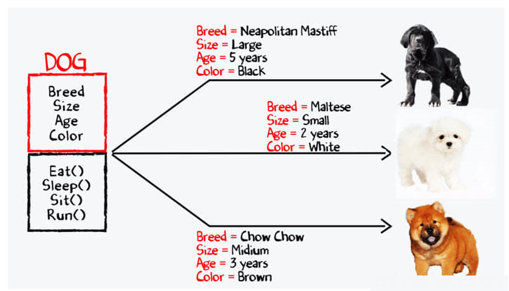

# Module 3 – Activity 3 – Dog Class (Dart)

[](https://tjakoen.github.io/notes/ten-times-zero)


Your first class. Turn the diagram into Dart code that applies the principles of
object-oriented programming: data (attributes) and behaviour (methods) bundled
into one blueprint, then used to make objects.

## The diagram



Text version of the same diagram:

```
        DOG
  ┌─────────────────┐
  │ Breed           │      Neapolitan Mastiff · Large  · 5 yrs · Black
  │ Size            │      Maltese            · Small  · 2 yrs · White
  │ Age             │      Chow Chow          · Medium · 3 yrs · Brown
  │ Color           │
  ├─────────────────┤
  │ Eat()  Sleep()  │
  │ Sit()  Run()    │
  └─────────────────┘
```

One `Dog` **class** (the box) describes every dog; each row on the right is one
**object** made from it.

## What to do

### 1. Fill in your details

Open `student.json` and fill in every field (use the **class code** your
instructor gave you):

```json
{
  "classCode": "1234",
  "fullName": "Juan Dela Cruz",
  "studentNumber": "2026-12345",
  "studentEmail": "juan.delacruz@hau.edu.ph",
  "personalEmail": "juan@example.com",
  "githubAccount": "juandelacruz"
}
```

> **Keep `student.json` identical across all your activities.** The autograder
> cross-checks these fields between your repos, and a mismatch (e.g. a different
> `classCode` in one activity) is flagged. The `classCode` must also match the
> one in your repo name.

### 2. Write the class

Open [`bin/dog.dart`](bin/dog.dart) and complete the `Dog` class:

| Member | What it is |
| --- | --- |
| `Dog(breed, size, age, color)` | constructor; `age` is an `int`, the rest are `String` |
| `breed`, `size`, `age`, `color` | the four attributes |
| `eat()` | returns `'<breed> is eating'` |
| `sleep()` | returns `'<breed> is sleeping'` |
| `sit()` | returns `'<breed> is sitting'` |
| `run()` | returns `'<breed> is running'` |

For example, `Dog('Maltese', 'Small', 2, 'White').eat()` returns
`'Maltese is eating'`.

Then in `main()`, create the **three dogs** from the diagram and print their
details and a couple of actions, so you can see your class in use.

> **Concepts to research** - see the **Module 3 – OOP** cheat sheet in your
> workspace repo (`content/cheat-sheets/dart-m3-oop.md`): a class with fields, a
> constructor, methods, creating objects, and string interpolation (`$breed`).

Run it yourself:

```bash
dart run bin/dog.dart
```

## Set up your repo

Before you write any code, create **your own copy** of this activity from the
template. Do not work in the template itself.

1. **Create from the template.** Open the template repo and click
   **Use this template → Create a new repository**.
2. **Set the owner to the course org.** Under *Owner*, choose the **`HAU-6ADET`
   course org**, **not** your personal account.
3. **Name it by the convention** `m<module>a<activity>-<classcode>-<yourname>`.
   For this activity that's **`m3a3-<classcode>-yourname`** (e.g.
   `m3a3-1234-juandelacruz`). The `<classcode>` must match the one you put in
   `student.json`.
4. **Make it Private.** Set *Visibility* to **Private** so classmates can't see
   your work.

Then clone **your** new repo and work there:

```bash
git clone https://github.com/HAU-6ADET/m3a3-<classcode>-yourname.git
cd m3a3-<classcode>-yourname
```

## Running the tests

```bash
dart pub get
dart test
```

This activity is graded by **4 tests** (1 point each). They check:

- ✅ `student.json` is completely filled in (1 test)
- ✅ a `Dog` stores its breed, size, age and color (1 test)
- ✅ `eat()` and `sleep()` return the right text (1 test)
- ✅ `sit()` and `run()` return the right text (1 test)

Each part is graded independently, so you earn partial credit.

## Confirm your submission

Your repo **is** your submission, so there is nothing to upload anywhere. When the
tests pass locally, **commit and push** so your work is recorded:

```bash
git add -A
git commit -m "Activity 3 complete"
git push
```

Pushing triggers the **Autograde** workflow. Confirm your submission landed:

1. Open your repo on GitHub and click the **Actions** tab.
2. Open the latest **Autograde** run and confirm the green ✅ check
   and the "4 / 4 tests passed" summary.

## 💻 Work in a Codespace (recommended)

A **Codespace** is a complete dev environment that runs in the cloud, so you do
not have to install Node, Dart, or anything else on your own laptop. This repo is
already configured: open a Codespace and everything you need is ready.

**Open one:** click the green **Code** button → **Codespaces** tab → **Create
codespace on main**. The first launch takes a minute to set up; after that it is
instant. Then run the activity from its terminal exactly as described below.

**Use it in VS Code (recommended).** It works in the browser, but it is nicer in
the desktop app: install the **GitHub Codespaces** extension in VS Code, or from
the running Codespace click the menu (☰) → **Open in VS Code Desktop**. Same
environment, your own editor.

### ⏱️ Make your free hours last (please read)
Your GitHub Education account includes a generous but limited monthly Codespaces
allowance. Three habits keep you from wasting it:

1. **Set your idle timeout to 10 minutes.** Go to
   **github.com/settings/codespaces → Default idle timeout → 10 minutes → Save.**
   A Codespace keeps running (and spending your hours) when you walk away; this
   makes it auto-stop after 10 idle minutes.
2. **Stop it when you finish - don't just close the tab.** Closing the browser
   leaves it running. Stop it at **github.com/codespaces → ••• → Stop
   codespace**, or from inside the editor open the **Command Palette**
   (`Ctrl`/`Cmd`+`Shift`+`P`, or **F1**) and run
   *Codespaces: Stop Current Codespace*.
3. **Delete the Codespace once you've submitted this activity.** Every activity
   gets its own Codespace, so old ones pile up and use your storage. After your
   final push: **github.com/codespaces → ••• → Delete.** You can always recreate
   it later from the green **Code** button.

---
📚 **These materials were authored by [tjakoen](https://github.com/tjakoen), built with Claude.** I use AI in the open, and I expect you to use it to learn the material, not to skip the learning. [How I actually work with AI →](https://tjakoen.github.io/notes/ten-times-zero)
